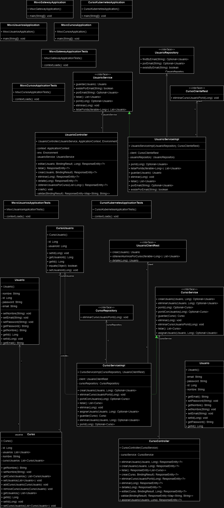

# Un poco de todo

Un proyecto Spring Boot, que utiliza Postgres (para cursos) y MySQL (para usuarios), Docker para aislar aplicaciones en contenedores y Kubernetes para manejar esos contenedores.

[//]: # (![Main image]&#40;images/minikube.png&#41;)

## Tabla de Contenidos

1. [Herramientas](#herramientas-usadas)
2. [Instalación](#instalación)
3. [Endpoints](#endpoints)
4. [ReadinessProbe y LivenessProbe](#readinessprobe-y-livenessprobe)
5. [Estructura del proyecto](#estructura-del-proyecto)
6. [Diagrama UML](#diagrama-uml)

## Herramientas usadas

- Spring Boot
  - DevTools
  - Spring Web
  - Spring Data JPA
  - MySQL Driver (para Cursos): Version 8
  - PostgreSQL Driver (para Estudiantes): Version 16
  - OpenFeign
  - Validation
- Docker
- Kubernetes (Minikube)


## Instalación

### ¿Qué hay de diferente en esta rama?

### Por ahora es muy similar al proyecto Kubernetes, pero agregandole Prometheus y Grafana, el proyecto Kubernetes lo puedes encontrar aquí: https://github.com/ChanoChoca/SpringBootKubernetes

Aplicar archivos de monitorización:
``` bash
cd operator_k8s
kubectl apply -f .
```

Instalar Brew y Helm

Instalar kube-prometheus-stack
- kube-prometheus-stack incluye:
  - Prometheus Operator: Para gestionar la configuración de Prometheus y Alertmanager.
  - Prometheus: Para recopilar y almacenar métricas.
  - Alertmanager: Para gestionar y enviar alertas.
  - Grafana: Para la visualización de métricas y la creación de dashboards.
  - Node Exporter: Para recopilar métricas del sistema operativo de los nodos.
  - Kube-State-Metrics: Para recopilar métricas del estado de los objetos de Kubernetes.
``` bash
helm repo add prometheus-community https://prometheus-community.github.io/helm-charts
helm repo update
helm install prometheus prometheus-community/kube-prometheus-stack
```

Exponer los servicios Prometheus y Grafana
- `kubectl port-forward svc/prometheus-kube-prometheus-prometheus 9090:9090`
- `kubectl port-forward service/prometheus-grafana 3000:80`

Obtener contraseña (**la contraseña debe decodificarse en Base 64 con UTF-8:** https://www.base64decode.org/es/)
- `kubectl get secrets`
- `kubectl get secret <secret-name> -o jsonpath="{.data.admin-password}"`

Para acceder a Prometheus y Grafana: http://localhost:3000 y http://localhost:9090

## Endpoints

### Usuarios

- **GET /usuarios**
  - **Descripción:** Obtiene un listado de usuarios, información del POD al que estás conectado (nombre e IP) y un texto con la configuración actual.
  - **Respuesta:**
    - Estado 200 OK
    - Cuerpo de la respuesta: `{ "users": [Array de usuarios], "podInfo": "Información del POD", "texto": "Texto de configuración" }`

- **GET /usuarios/crash**
  - **Descripción:** Simula una caída del servidor cerrando el contexto de Spring.
  - **Respuesta:**
    - Estado 200 OK (El servidor se cerrará y no responderá después de esta solicitud).

- **GET /usuarios/{id}**
  - **Descripción:** Muestra los datos de un usuario específico por su ID.
  - **Parámetros de ruta:**
    - `id` - ID del usuario a buscar.
  - **Respuesta:**
    - Estado 200 OK si el usuario se encuentra.
    - Estado 404 Not Found si el usuario no se encuentra.

- **POST /usuarios**
  - **Descripción:** Permite crear un nuevo usuario.
  - **Cuerpo de la solicitud:**
    - `{ "nombre": "Nombre del usuario", "email": "Email del usuario", "password": "Contraseña del usuario" }`
  - **Precondiciones:**
    - El campo `email` no debe estar vacío y debe ser único.
  - **Respuesta:**
    - Estado 201 Created si el usuario se crea exitosamente.
    - Estado 400 Bad Request si el email ya existe o el email está vacío.

- **PUT /usuarios/{id}**
  - **Descripción:** Permite actualizar los datos de un usuario existente.
  - **Parámetros de ruta:**
    - `id` - ID del usuario a actualizar.
  - **Cuerpo de la solicitud:**
    - `{ "nombre": "Nombre actualizado", "email": "Email actualizado", "password": "Contraseña actualizada" }`
  - **Precondiciones:**
    - El campo `email` no debe estar vacío y debe ser único si se modifica.
  - **Respuesta:**
    - Estado 201 Created si el usuario se actualiza exitosamente.
    - Estado 404 Not Found si el usuario no se encuentra.
    - Estado 400 Bad Request si el email ya existe o el email está vacío.

- **DELETE /usuarios/{id}**
  - **Descripción:** Permite eliminar un usuario dado su ID.
  - **Parámetros de ruta:**
    - `id` - ID del usuario a eliminar.
  - **Respuesta:**
    - Estado 204 No Content si el usuario se elimina exitosamente.
    - Estado 404 Not Found si el usuario no se encuentra.

- **GET /usuarios/usuarios-por-curso**
  - **Descripción:** Muestra un listado de usuarios basados en una lista de IDs de curso.
  - **Parámetros de consulta:**
    - `ids` - Lista de IDs de los cursos para los cuales se buscan los usuarios.
  - **Respuesta:**
    - Estado 200 OK
    - Cuerpo de la respuesta: `{ "usuarios": [Array de usuarios] }`

### Cursos

- **GET /cursos**
  - **Descripción:** Obtiene un listado de todos los cursos disponibles.
  - **Respuesta:**
    - Estado 200 OK
    - Cuerpo de la respuesta: `{ "cursos": [Array de cursos] }`

- **GET /cursos/{id}**
  - **Descripción:** Devuelve los detalles de un curso específico junto con los usuarios asociados por su ID.
  - **Parámetros de ruta:**
    - `id` - ID del curso a buscar.
  - **Respuesta:**
    - Estado 200 OK si el curso se encuentra.
    - Estado 404 Not Found si el curso no se encuentra.

- **POST /cursos**
  - **Descripción:** Permite crear un nuevo curso.
  - **Cuerpo de la solicitud:**
    - `{ "nombre": "Nombre del curso", "descripcion": "Descripción del curso" }`
  - **Respuesta:**
    - Estado 201 Created si el curso se crea exitosamente.
    - Estado 400 Bad Request si los datos son inválidos.

- **PUT /cursos/{id}**
  - **Descripción:** Permite actualizar un curso existente.
  - **Parámetros de ruta:**
    - `id` - ID del curso a actualizar.
  - **Cuerpo de la solicitud:**
    - `{ "nombre": "Nombre actualizado", "descripcion": "Descripción actualizada" }`
  - **Respuesta:**
    - Estado 201 Created si el curso se actualiza exitosamente.
    - Estado 404 Not Found si el curso no se encuentra.
    - Estado 400 Bad Request si los datos son inválidos.

- **DELETE /cursos/{id}**
  - **Descripción:** Permite eliminar un curso dado su ID.
  - **Parámetros de ruta:**
    - `id` - ID del curso a eliminar.
  - **Respuesta:**
    - Estado 204 No Content si el curso se elimina exitosamente.
    - Estado 404 Not Found si el curso no se encuentra.

- **PUT /cursos/asignar-usuario/{cursoId}**
  - **Descripción:** Asigna un usuario a un curso específico.
  - **Parámetros de ruta:**
    - `cursoId` - ID del curso al que se asignará el usuario.
  - **Cuerpo de la solicitud:**
    - `{ "id": "ID del usuario", "nombre": "Nombre del usuario", "email": "Email del usuario" }`
  - **Respuesta:**
    - Estado 201 Created si el usuario se asigna exitosamente.
    - Estado 404 Not Found si ocurre un error en la asignación.

- **POST /cursos/crear-usuario/{cursoId}**
  - **Descripción:** Crea un nuevo usuario y lo asigna a un curso específico.
  - **Parámetros de ruta:**
    - `cursoId` - ID del curso al que se asignará el nuevo usuario.
  - **Cuerpo de la solicitud:**
    - `{ "nombre": "Nombre del usuario", "email": "Email del usuario", "password": "Contraseña del usuario" }`
  - **Respuesta:**
    - Estado 201 Created si el usuario se crea y se asigna exitosamente.
    - Estado 404 Not Found si ocurre un error en la creación o asignación.

- **DELETE /cursos/eliminar-usuario/{cursoId}**
  - **Descripción:** Elimina un usuario de un curso específico.
  - **Parámetros de ruta:**
    - `cursoId` - ID del curso del cual se eliminará el usuario.
  - **Cuerpo de la solicitud:**
    - `{ "id": "ID del usuario" }`
  - **Respuesta:**
    - Estado 200 OK si el usuario se elimina exitosamente.
    - Estado 404 Not Found si ocurre un error en la eliminación.

- **DELETE /cursos/eliminar-curso-usuario/{id}**
  - **Descripción:** Elimina todos los usuarios de un curso específico por su ID.
  - **Parámetros de ruta:**
    - `id` - ID del curso del cual se eliminarán los usuarios.
  - **Respuesta:**
    - Estado 204 No Content si se eliminan todos los usuarios correctamente.
    - Estado 404 Not Found si el curso no se encuentra.

  
## ReadinessProbe y LivenessProbe

Implementado en `deployment-usuarios.yaml`

- readinessProbe: Determina si el pod está listo para recibir tráfico. Si el pod no está listo, Kubernetes no enviará tráfico a él. 
  - **path**: Ruta en el endpoint del pod para verificar la preparación.
  - **port**: Puerto en el que se realiza la verificación.
  - **scheme**: Protocolo utilizado para la verificación (HTTP o HTTPS).
  - **initialDelaySeconds**: Tiempo a esperar antes de realizar la primera verificación.
  - **periodSeconds**: Intervalo entre las verificaciones.
  - **timeoutSeconds**: Tiempo máximo para esperar una respuesta.
  

- livenessProbe: Determina si el pod sigue vivo y operativo. Si un pod falla la sonda de vivacidad, Kubernetes lo reiniciará.
  - **path**: Ruta en el endpoint del pod para verificar la vivacidad.
  - **port**: Puerto en el que se realiza la verificación.
  - **scheme**: Protocolo utilizado para la verificación (HTTP o HTTPS).
  - **initialDelaySeconds**: Tiempo a esperar antes de realizar la primera verificación.
  - **periodSeconds**: Intervalo entre las verificaciones. 
  - **timeoutSeconds**: Tiempo máximo para esperar una respuesta.

## Estructura del proyecto

``` bash
│   .gitignore
│   configmap.yaml
│   deployment-cursos.yaml
│   deployment-mysql.yaml
│   deployment-postgres.yaml
│   deployment-usuarios.yaml
│   docker-compose.yaml
│   gateway.yaml
│   mvnw
│   mvnw.cmd
│   mysql-pv.yaml
│   mysql-pvc.yaml
│   pom.xml
│   postgres-pv.yaml
│   postgres-pvc.yaml
│   README.md
│   secret.yaml
│   svc-cursos.yaml
│   svc-mysql.yaml
│   svc-postgres.yaml
│   svc-usuarios.yaml
│       
├───images
│       minikube.png
│       uml.png
│       
├───msvc-cursos
│   │   .env
│   │   .gitignore
│   │   Dockerfile
│   │   mvnw
│   │   mvnw.cmd
│   │   pom.xml
│   │           
│   ├───src
│   │   ├───main
│   │   │   ├───java
│   │   │   │   └───org
│   │   │   │       └───chanochoca
│   │   │   │           └───springcloud
│   │   │   │               └───msvc
│   │   │   │                   └───cursos
│   │   │   │                       │   MsvcCursosApplication.java
│   │   │   │                       │   
│   │   │   │                       ├───clients
│   │   │   │                       │       UsuarioClientRest.java
│   │   │   │                       │       
│   │   │   │                       ├───controllers
│   │   │   │                       │       CursoController.java
│   │   │   │                       │       
│   │   │   │                       ├───models
│   │   │   │                       │   │   Usuario.java
│   │   │   │                       │   │   
│   │   │   │                       │   └───entity
│   │   │   │                       │           Curso.java
│   │   │   │                       │           CursoUsuario.java
│   │   │   │                       │           
│   │   │   │                       ├───repositories
│   │   │   │                       │       CursoRepository.java
│   │   │   │                       │       
│   │   │   │                       └───services
│   │   │   │                               CursoService.java
│   │   │   │                               CursoServiceImpl.java
│   │   │   │                               
│   │   │   └───resources
│   │   │           application.properties
│   │   │           
│   │   └───test
│   │       └───java
│   │           └───org
│   │               └───chanochoca
│   │                   └───springcloud
│   │                       └───msvc
│   │                           └───cursos
│   │                                   MsvcCursosApplicationTests.java
│   │                                   
│   └───target
│       └───classes
│               application.properties
│               
├───msvc-gateway
│   │   .gitignore
│   │   Dockerfile
│   │   HELP.md
│   │   mvnw
│   │   mvnw.cmd
│   │   pom.xml
│   │   
│   ├───.mvn
│   │   └───wrapper
│   │           maven-wrapper.properties
│   │           
│   ├───src
│   │   ├───main
│   │   │   ├───java
│   │   │   │   └───com
│   │   │   │       └───chanochoca
│   │   │   │           └───springcloud
│   │   │   │               └───msvc
│   │   │   │                   └───gateway
│   │   │   │                           MsvcGatewayApplication.java
│   │   │   │                           
│   │   │   └───resources
│   │   │           application.properties
│   │   │           application.yml
│   │   │           
│   │   └───test
│   │       └───java
│   │           └───com
│   │               └───chanochoca
│   │                   └───springcloud
│   │                       └───msvc
│   │                           └───gateway
│   │                                   MsvcGatewayApplicationTests.java
│   │                                   
│   └───target
│       ├───classes
│       │   │   application.properties
│       │   │   application.yml
│       │   │   
│       │   └───com
│       │       └───chanochoca
│       │           └───springcloud
│       │               └───msvc
│       │                   └───gateway
│       │                           MsvcGatewayApplication.class
│       │                           
│       ├───generated-sources
│       │   └───annotations
│       ├───generated-test-sources
│       │   └───test-annotations
│       └───test-classes
│           └───com
│               └───chanochoca
│                   └───springcloud
│                       └───msvc
│                           └───gateway
│                                   MsvcGatewayApplicationTests.class
│                                   
├───msvc-usuarios
│   │   .env
│   │   .gitignore
│   │   Dockerfile
│   │   mvnw
│   │   mvnw.cmd
│   │   pom.xml
│   │   
│   ├───.mvn
│   │   └───wrapper
│   │           maven-wrapper.properties
│   │           
│   ├───src
│   │   ├───main
│   │   │   ├───java
│   │   │   │   └───org
│   │   │   │       └───chanochoca
│   │   │   │           └───springcloud
│   │   │   │               └───msvc
│   │   │   │                   └───usuarios
│   │   │   │                       │   MsvcUsuariosApplication.java
│   │   │   │                       │   
│   │   │   │                       ├───clients
│   │   │   │                       │       CursoClienteRest.java
│   │   │   │                       │       
│   │   │   │                       ├───controllers
│   │   │   │                       │       UsuarioController.java
│   │   │   │                       │       
│   │   │   │                       ├───models
│   │   │   │                       │   └───entity
│   │   │   │                       │           Usuario.java
│   │   │   │                       │           
│   │   │   │                       ├───repositories
│   │   │   │                       │       UsuarioRepository.java
│   │   │   │                       │       
│   │   │   │                       └───services
│   │   │   │                               UsuarioService.java
│   │   │   │                               UsuarioServiceImpl.java
│   │   │   │                               
│   │   │   └───resources
│   │   │           application.properties
│   │   │           
│   │   └───test
│   │       └───java
│   │           └───org
│   │               └───chanochoca
│   │                   └───springcloud
│   │                       └───msvc
│   │                           └───usuarios
│   │                                   MsvcUsuariosApplicationTests.java
│   │                                   
│   └───target
│       └───classes
│               application.properties
│               
└───src
    ├───main
    │   ├───java
    │   │   └───com
    │   │       └───chanochoca
    │   │           └───springcloud
    │   │               └───msvc
    │   │                       CursoKubernetesApplication.java
    │   │                       
    │   └───resources
    │           application.properties
    │           
    └───test
        └───java
            └───com
                └───chanochoca
                    └───springcloud
                        └───msvc
                                CursoKubernetesApplicationTests.java
```

## Diagrama UML



## Authors

- [@Juan Ignacio Caprioli (ChanoChoca)](https://github.com/ChanoChoca)

## Badges

[//]: # (Add badges from somewhere like: [shields.io]&#40;https://shields.io/&#41;)

[](https://choosealicense.com/licenses/mit/)

[](https://opensource.org/licenses/)

[](http://www.gnu.org/licenses/agpl-3.0)
