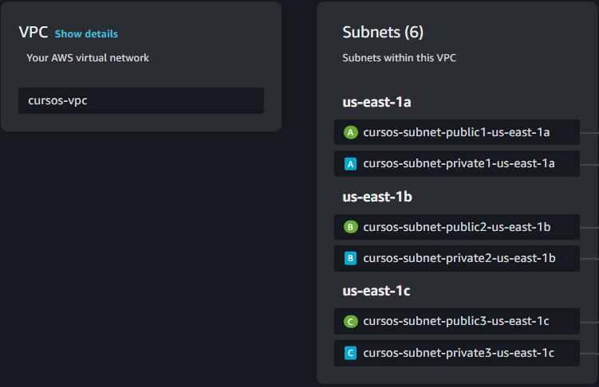

# Un poco de todo

A diferencia de la rama principal, esta rama sirve para implementar en AWS ECS un clúster, con dos deployment, cada uno con ELB, con volúmen EFS asociadas a las bases de datos.

## Tabla de Contenidos

1. [Configuration Steps](#configuration-steps)
2. [Endpoints](#endpoints)

## Configuration Steps

### Virtual Private Cloud (VPC)

1. **Create a new VPC**:
    - Enable **Auto-generate**, desired name. 
    - IPv4 CIDR block, with IP range `10.0.0.0/16`.
    - No IPv6 CIDR block.
    - **Tenancy**: Default.
    - **Number of Availability Zones (AZs)**: 3.
    - **Number of subnets**: 3 public and 3 private.
    - **NAT Gateway**: None.
    - **VPC Endpoints**: None.
    - **DNS Options**: Enable DNS hostnames and DNS resolution.
    - **Additional tags**: None.

You should see something similar to the following (in resource map of the selected VPC).

### Security Groups

1. **Create Security Group for Microservices (sgMsvc)**:
    - Description: *Service Group for Microservices*.
    - Select the created VPC.
    - **Inbound Rules**:
        - TCP, Port 8001, Source: Anywhere (IPv4).
        - TCP, Port 8002, Source: Anywhere (IPv4).
    - **Outbound Rules**:
        - All traffic, Destination: Anywhere (IPv4).

2. **Create Security Group for EFS (sgNfs)**:
    - Description: *Service Group for EFS*.
    - Select the created VPC.
    - **Inbound Rules**:
        - NFS, Source: `sgMsvc`.
    - **Outbound Rules**:
        - All traffic, Destination: Anywhere (IPv4).

### Elastic File System (EFS)

1. **EFS Names**: Use `datos-postgres`, after create for `datos-mysql`, and the created VPC.
2. **Subnets**: Ensure the VPC subnets are added (in this case: `us-east-1a`, `us-east-1b`, `us-east-1c`).
3. **Associate Security Group for each Subnet**: Link `sgNfs`.

### Target Groups

1. **Create Target Groups**: `tgUsuarios` and `tgCursos`.
    - Select IP addresses.
    - Protocol: HTTP on port 8001 or 8002 (as applicable).
    - IP address type: IPv4.
    - Select created VPC.
    - Protocol version: HTTP1.
    - **Health Checks**:
        - HTTP protocol 
        - Path: `/usuarios` or `/cursos` (as applicable).
        - **Advanced Settings**:
            - Health check port: Traffic port.
            - Healthy threshold: 5.
            - Unhealthy threshold: 2.
            - Timeout: 60.
            - Interval: 300.
            - Success codes: 200.

### Load Balancers

1. **Create Application Load Balancer**: `lbUsuarios` and `lbCursos`.
    - Internet-facing, IPv4.
    - Select created VPC.
    - Select all available public subnets.
    - Associate with security group `sgMsvc`.
    - Modify the listener port from 80 to 8001 or 8002 (as applicable), protocol HTTP.
    - Associate with the relevant target group.

### IAM

1. **Create ECS role**: in Access management -> Roles.
    - Search for `AWSServiceRoleForECS`, select and create role.
    - Select AWS service.
    - Use case: `Elastic Container Service`.
    - Select Elastic Container Service Task, then next.
    - Search for `AmazonECSTaskExecutionRolePolicy`, select, then next.
    - Role Name: `ECSTaskExecutionRole`, then create role.

### Task Definitions

#### Task Definition for `msvc-usuarios`

1. **Basic Configuration**:
    - Family: `msvc-usuarios`.
    - Platform: AWS Fargate.
    - OS: Linux/X86_64, 1vCPU, 2GB.
    - Task role: None.
    - Execution role: Use the created role.

2. **Container 1**: `msvc-usuarios`
    - Image: `chanochoca/usuarios:latest`.
    - Essential container: No.
    - Port mapping: 8001 (TCP).
    - CPU: 1, Memory hard: 1GB, Memory soft: 1GB.
    - **Environment Variables**:
        - `CURSOS_URL`: `<loadbalancerCursos>:<port>`.
        - `DB_DATABASE`: `msvc-usuarios`.
        - `DB_HOST`: `localhost:3306`.
        - `DB_PASSWORD`: `chanochoca`.
        - `DB_USERNAME`: `root`.
        - `PORT`: `8001`.
    - Enable log collection.

3. **Container 2**: `mysql8`
    - Image: `mysql:8`.
    - Essential container: Yes.
    - Port mapping: 3306 (TCP).
    - CPU: 0, Memory hard: 1GB, Memory soft: 1GB.
    - **Environment Variables**:
        - `MYSQL_DATABASE`: `msvc-usuarios`.
        - `MYSQL_ROOT_PASSWORD`: `chanochoca`.

4. **Storage**:
    - Volume: `data-mysql`.
    - Configure at task definition creation.
    - File system: EFS `datos-mysql`, root directory `/`, access point id `None`.
    - Container Mount point: 
      - Container: `mysql8`
      - Source volume: `data-mysql`
      - Container path: `/var/lib/mysql` (Read-only: No).

#### Task Definition for `msvc-cursos`

1. **Basic Configuration**:
    - Family: `msvc-cursos`.
    - Platform: AWS Fargate.
    - OS: Linux/X86_64, 1vCPU, 2GB.
    - Task role: None.
    - Execution role: Use the created role.

2. **Container 1**: `msvc-cursos`
    - Image: `chanochoca/cursos:latest`.
    - Essential container: No.
    - Port mapping: 8002 (TCP).
    - CPU: 1, Memory hard: 1GB, Memory soft: 1GB.
    - **Environment Variables**:
        - `USUARIOS_URL`: `<loadbalancerUsuarios>:<port>`.
        - `DB_DATABASE`: `msvc-cursos`.
        - `DB_HOST`: `localhost:5432`.
        - `DB_PASSWORD`: `postgres`.
        - `DB_USERNAME`: `postgres`.
        - `PORT`: `8002`.
    - Enable log collection.

3. **Container 2**: `postgres16`
    - Image: `postgres:16.4-alpine3.20`.
    - Essential container: Yes.
    - Port mapping: 5432 (TCP).
    - CPU: 0, Memory hard: 1GB, Memory soft: 1GB.
    - **Environment Variables**:
        - `POSTGRES_DB`: `msvc-cursos`.
        - `POSTGRES_PASSWORD`: `postgres`.

4. **Storage**:
    - Volume: `data-postgres`.
    - Configure at task definition creation.
    - File system: EFS `datos-postgres`, root directory `/`, access point id `None`.
    - Container Mount point:
      - Container: `postgres16`
      - Source volume: `data-postgres`
      - Container path: `/var/lib/postgresql/data` (Read-only: No).

### Cluster and Service Deployment

1. **Create Cluster**: `curso-aws`.

2. **Deploy Services**:
    - Select task definitions for `msvc-usuarios` and `msvc-cursos`, then select deploy and Create service.
    - Select in Existing cluster: the created cluster.
    - Select in Compute options: Launch Type.
    - Set service name to `usuarios` or `cursos` as appropriate.
    - Select the created VPC and all subnets, then select only the security group `sgMsvc`.
    - Enable Public IP.
    - In Load balancing, select `Application Load Balancer`.
    - Select Container for load balancing: `msvc-cursos 8002:8002` or `msvc-usuarios 8001:8001`.
    - Select an existing load balancer (`lbUsuarios` or `lbCursos`).
    - Use existing listeners and target groups as needed.

**Enjoy!**

**Also you may use API Gateway for handle one URL for this two deployments, or use RDS to easily manage databases, feel free to do this.**

## Endpoints

### Usuarios

- **GET /usuarios**
    - **Descripción:** Obtiene un listado de usuarios, información del POD al que estás conectado (nombre e IP) y un texto con la configuración actual.
    - **Respuesta:**
        - Estado 200 OK
        - Cuerpo de la respuesta: `{ "users": [Array de usuarios], "podInfo": "Información del POD", "texto": "Texto de configuración" }`

- **GET /usuarios/crash**
    - **Descripción:** Simula una caída del servidor cerrando el contexto de Spring.
    - **Respuesta:**
        - Estado 200 OK (El servidor se cerrará y no responderá después de esta solicitud).

- **GET /usuarios/{id}**
    - **Descripción:** Muestra los datos de un usuario específico por su ID.
    - **Parámetros de ruta:**
        - `id` - ID del usuario a buscar.
    - **Respuesta:**
        - Estado 200 OK si el usuario se encuentra.
        - Estado 404 Not Found si el usuario no se encuentra.

- **POST /usuarios**
    - **Descripción:** Permite crear un nuevo usuario.
    - **Cuerpo de la solicitud:**
        - `{ "nombre": "Nombre del usuario", "email": "Email del usuario", "password": "Contraseña del usuario" }`
    - **Precondiciones:**
        - El campo `email` no debe estar vacío y debe ser único.
    - **Respuesta:**
        - Estado 201 Created si el usuario se crea exitosamente.
        - Estado 400 Bad Request si el email ya existe o el email está vacío.

- **PUT /usuarios/{id}**
    - **Descripción:** Permite actualizar los datos de un usuario existente.
    - **Parámetros de ruta:**
        - `id` - ID del usuario a actualizar.
    - **Cuerpo de la solicitud:**
        - `{ "nombre": "Nombre actualizado", "email": "Email actualizado", "password": "Contraseña actualizada" }`
    - **Precondiciones:**
        - El campo `email` no debe estar vacío y debe ser único si se modifica.
    - **Respuesta:**
        - Estado 201 Created si el usuario se actualiza exitosamente.
        - Estado 404 Not Found si el usuario no se encuentra.
        - Estado 400 Bad Request si el email ya existe o el email está vacío.

- **DELETE /usuarios/{id}**
    - **Descripción:** Permite eliminar un usuario dado su ID.
    - **Parámetros de ruta:**
        - `id` - ID del usuario a eliminar.
    - **Respuesta:**
        - Estado 204 No Content si el usuario se elimina exitosamente.
        - Estado 404 Not Found si el usuario no se encuentra.

- **GET /usuarios/usuarios-por-curso**
    - **Descripción:** Muestra un listado de usuarios basados en una lista de IDs de curso.
    - **Parámetros de consulta:**
        - `ids` - Lista de IDs de los cursos para los cuales se buscan los usuarios.
    - **Respuesta:**
        - Estado 200 OK
        - Cuerpo de la respuesta: `{ "usuarios": [Array de usuarios] }`

### Cursos

- **GET /cursos**
    - **Descripción:** Obtiene un listado de todos los cursos disponibles.
    - **Respuesta:**
        - Estado 200 OK
        - Cuerpo de la respuesta: `{ "cursos": [Array de cursos] }`

- **GET /cursos/{id}**
    - **Descripción:** Devuelve los detalles de un curso específico junto con los usuarios asociados por su ID.
    - **Parámetros de ruta:**
        - `id` - ID del curso a buscar.
    - **Respuesta:**
        - Estado 200 OK si el curso se encuentra.
        - Estado 404 Not Found si el curso no se encuentra.

- **POST /cursos**
    - **Descripción:** Permite crear un nuevo curso.
    - **Cuerpo de la solicitud:**
        - `{ "nombre": "Nombre del curso" }`
    - **Respuesta:**
        - Estado 201 Created si el curso se crea exitosamente.
        - Estado 400 Bad Request si los datos son inválidos.

- **PUT /cursos/{id}**
    - **Descripción:** Permite actualizar un curso existente.
    - **Parámetros de ruta:**
        - `id` - ID del curso a actualizar.
    - **Cuerpo de la solicitud:**
        - `{ "nombre": "Nombre actualizado" }`
    - **Respuesta:**
        - Estado 201 Created si el curso se actualiza exitosamente.
        - Estado 404 Not Found si el curso no se encuentra.
        - Estado 400 Bad Request si los datos son inválidos.

- **DELETE /cursos/{id}**
    - **Descripción:** Permite eliminar un curso dado su ID.
    - **Parámetros de ruta:**
        - `id` - ID del curso a eliminar.
    - **Respuesta:**
        - Estado 204 No Content si el curso se elimina exitosamente.
        - Estado 404 Not Found si el curso no se encuentra.

- **PUT /cursos/asignar-usuario/{cursoId}**
    - **Descripción:** Asigna un usuario a un curso específico.
    - **Parámetros de ruta:**
        - `cursoId` - ID del curso al que se asignará el usuario.
    - **Cuerpo de la solicitud:**
        - `{ "id": "ID del usuario", "nombre": "Nombre del usuario", "email": "Email del usuario", "password": "Contraseña del usuario" }`
    - **Respuesta:**
        - Estado 201 Created si el usuario se asigna exitosamente.
        - Estado 404 Not Found si ocurre un error en la asignación.

- **POST /cursos/crear-usuario/{cursoId}**
    - **Descripción:** Crea un nuevo usuario y lo asigna a un curso específico.
    - **Parámetros de ruta:**
        - `cursoId` - ID del curso al que se asignará el nuevo usuario.
    - **Cuerpo de la solicitud:**
        - `{ "nombre": "Nombre del usuario", "email": "Email del usuario", "password": "Contraseña del usuario" }`
    - **Respuesta:**
        - Estado 201 Created si el usuario se crea y se asigna exitosamente.
        - Estado 404 Not Found si ocurre un error en la creación o asignación.

- **DELETE /cursos/eliminar-usuario/{cursoId}**
    - **Descripción:** Elimina un usuario de un curso específico.
    - **Parámetros de ruta:**
        - `cursoId` - ID del curso del cual se eliminará el usuario.
    - **Cuerpo de la solicitud:**
        - `{ "id": "ID del usuario" }`
    - **Respuesta:**
        - Estado 200 OK si el usuario se elimina exitosamente.
        - Estado 404 Not Found si ocurre un error en la eliminación.

- **DELETE /cursos/eliminar-curso-usuario/{id}**
    - **Descripción:** Elimina todos los usuarios de un curso específico por su ID.
    - **Parámetros de ruta:**
        - `id` - ID del curso del cual se eliminarán los usuarios.
    - **Respuesta:**
        - Estado 204 No Content si se eliminan todos los usuarios correctamente.
        - Estado 404 Not Found si el curso no se encuentra.}

## Authors

- [@Juan Ignacio Caprioli (ChanoChoca)](https://github.com/ChanoChoca)
